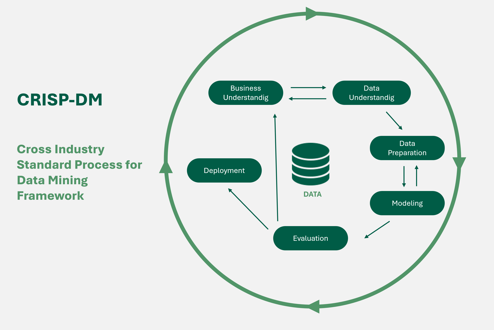
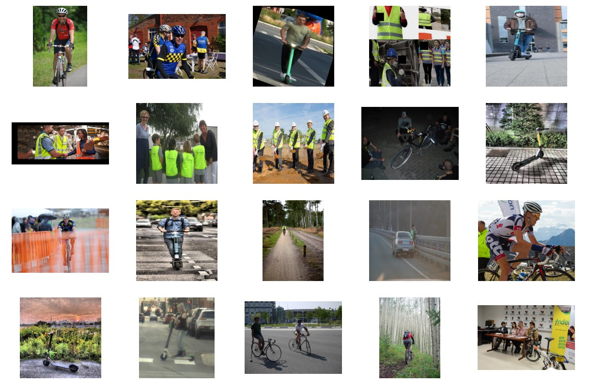
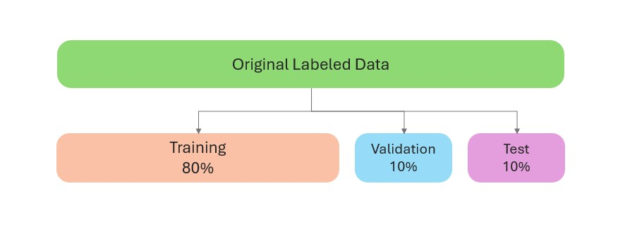
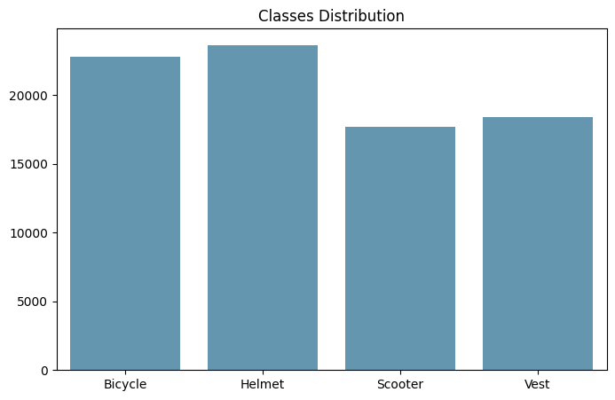
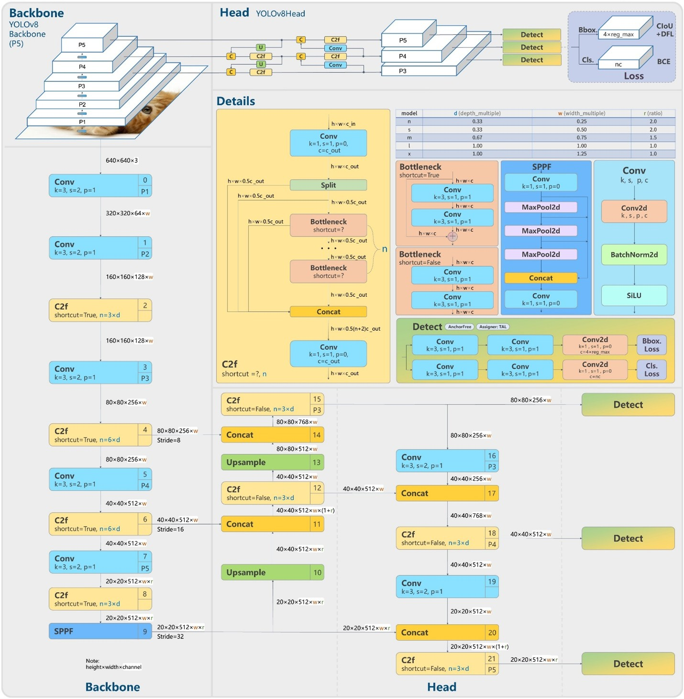
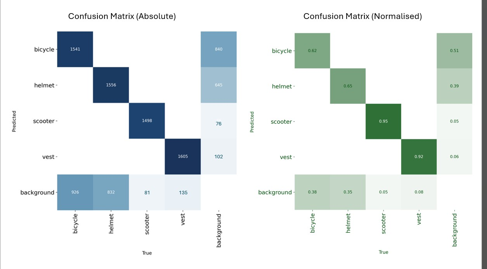
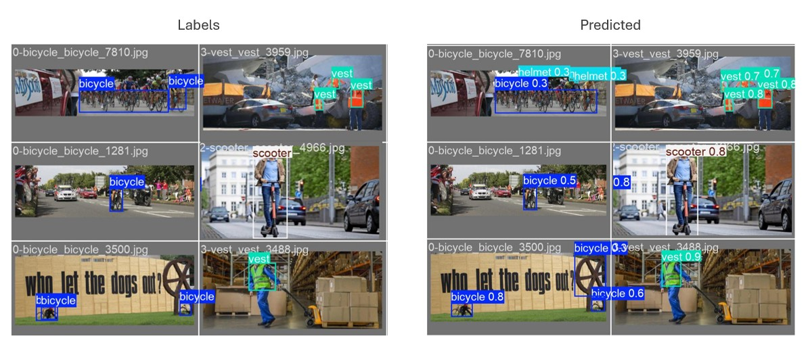
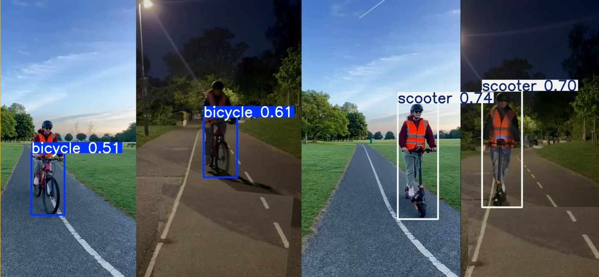

<h1 align="center">Identifying Cyclist Safety In Urban Traffic   Using Computer Vision</h1>

Cycling is an efficient, eco-friendly way of getting around cities. But to make it safer, we need better infrastructure and evidence-based policy. This project explores how computer vision can help **monitor cycle lanes**, track **protective gear usage**, and **generate structured data** to support public investment.

  

<h3 align="center"><strong>Final Year Capstone Project – BSc (Hons) in Computing Science and IT</strong>  
 
CCT College Dublin • May 2025</h3>

<h3 align="center">Supervisor: Dr. Muhammad Iqbal</h3>

## Research Question

<strong>Can computer vision be used to collect structured data that supports infrastructure planning and protective equipment legislation for cyclists?</strong>

## Methodology

This project followed the **CRISP-DM** methodology across all 6 phases.

  

This project follows the CRISP-DM methodology, a proven framework for data mining large datasets. The process is divided into six key phases:

1. **Business Understanding:** Define clear objectives and align project goals with business needs to create a structured plan for success.
2. **Data Understanding:** Collect and explore data to identify potential quality issues and gain initial insights.
3. **Data Preparation:** Clean, select, and integrate data to prepare it for modeling. This step is often repeated to ensure the data is well-suited for analysis.
4. **Modeling:** Experiment with different algorithms, architectures, and parameters to develop the best-performing model.
5. **Evaluation:** Assess the model’s results to ensure they meet the business objectives and deliver actionable insights.
6. **Deployment:** Make the final model available for real-world use, allowing stakeholders to benefit from its results.

## 1. Business Understanding

The objective was to build a model capable of detecting:
- Bicycles
- Scooters
- Helmets
- High-visibility vests

**Goal:** Achieve a mAP@50 ≥ 0.60 (actual result: 0.827)

## 2. Data Understanding

The dataset included over **62,000 images**, collected from:
- [Open Images V7](https://storage.googleapis.com/openimages/web/index.html)
- [Roboflow Universe](https://universe.roboflow.com)

  

After cleaning, the final dataset included **40,157 images**.

## 3. Data Preparation

Annotations followed the **YOLO format**, with one label file per image.  
The dataset was split into:

  

- Train: 32,121 images  
- Validation: 4,015 images  
- Test: 4,021 images

  

Manual annotation and review were performed using **Label Studio**.

## 4. Modeling

I used the YOLOv8 architecture, trained from pre-trained weights provided by Ultralytics (2024).

   
  
YOLOv8 Architecture (<a href="https://arxiv.org/abs/2408.15857">YASEEN, 2024</a>)
 

### Hyperparameters 

 Hyperparameter tuning involved experimenting with different optimizers (Adam and SGD), learning rates, batch sizes, and regularization techniques such as early stopping, weight decay, and dropout to improve model generalization and prevent overfitting. 

 The best results were achieved using the SGD optimizer with a learning rate of 0.01, momentum of 0.936, 150 epochs, batch size of 128, and an increased classification loss weight, reaching a final mAP@50 of 82.1%. 

| Optimizer | Epochs   | Batch | Learning Rate      | Box Loss | Classification Loss | Distribution Focal Loss | mAP@50  |
|-----------|----------|-------|--------------------|----------|---------------------|-------------------------|---------|
| Adam      | 50, 100  | 32, 64| 0.01, 0.001        | 7.0, 8.5 | 0.3, 7.5            | 1.5, 2.0                | 81.1%   |
| SGD       | 50, 100, 150, 200 | 64, 128 | 0.1, 0.01, 0.001, 0.0001 | 7.5, 8.5      | 0.5, 0.8, 0.9 | 1.5     | 82.7%   |

 Automated optimization with Optuna was also tested but did not surpass the manually tuned configuration. 

## 5. Evaluation

The model was evaluated on a held-out test set to ensure it met the business goal (mAP@50 ≥ 0.60).  
Key metrics included mean Average Precision (mAP), Precision, and Recall, all calculated using an IoU threshold of 0.7 for true positives. 

  

- **Precision** measures how many detected objects were correct, while **Recall** measures how many actual objects were detected. The model achieved an overall Precision of 78.7% and Recall of 80.4%. However, performance varied by class: "scooter" and "vest" had high scores, while "bicycle" and "helmet" were more challenging, with lower recall and precision due to more false negatives and false positives.

- **mAP@50** (mean Average Precision at IoU 0.5) summarizes the balance between precision and recall across all classes. **The final model achieved a mAP@50 of 0.827**, exceeding the project target. 

- The confusion matrix and per-class metrics highlighted that most errors were due to confusion with the background, especially for helmets and bicycles.

| Class    | Precision | Recall | mAP@50 | mAP@50–95 |
|----------|-----------|--------|--------|-----------|
| Bicycle  | 0.621     | 0.654  | 0.649  | 0.411     |
| Helmet   | 0.660     | 0.688  | 0.719  | 0.404     |
| Scooter  | 0.942     | 0.950  | 0.972  | 0.782     |
| Vest     | 0.925     | 0.922  | 0.969  | 0.816     |
| **All**  | 0.787     | 0.804  | 0.827  | 0.603     |

  

## 6. Deployment

I recorded a simulation to show the system working in two real-world scenarios:  
- On a bicycle  
- On a scooter  

Each test was recorded **day and night** to evaluate performance across lighting conditions.

  

**Watch the full deployment demo:**  
[Cycle Lane Detection – Video Demo (YouTube)](https://www.youtube.com/watch?v=vJMxqcAvS1o)

## Conclusion

- The final model exceeded the target, reaching a mAP@50 of 0.827 on the test set.
- Demonstrated the model’s potential in simulated real-world scenarios for cycle lane monitoring.
- Computer vision can automate data collection for infrastructure planning, safety campaigns, and policy analysis.
- Main challenge remains data quality and quantity, especially for underrepresented classes.
- Future work should focus on collecting more real-world data, particularly for helmets and bicycles, to further improve performance.

## Dataset

- **Available on Kaggle:** 
**[ciclovia-yolo.zip](https://www.kaggle.com/datasets/joelmarodrigues/ciclovia)**

## Technologies

- Python  
- Ultralytics YOLOv8  
- Jupyter Notebook
- Label Studio
- Roboflow
- OpenCV (for video processing)

## References

- Dilek, E. & Dener, M. (2023). *Computer Vision Applications in Intelligent Transportation Systems: A Survey*. Sensors, 23(6), 2938. [https://doi.org/10.3390/s23062938](https://doi.org/10.3390/s23062938)  
- Open Images Dataset (2022). *Open Images V7*. Google AI. Available at: [https://storage.googleapis.com/openimages/web/index.html](https://storage.googleapis.com/openimages/web/index.html) [Accessed 5 March 2025]  
- Roboflow (2020). *Roboflow: Annotate, manage, and train computer vision models*. [https://universe.roboflow.com/](https://universe.roboflow.com/) [Accessed 8 March 2025]  
- Jocher, G., Chaurasia, A. & Qiu, J. (2023). *Ultralytics YOLOv8 (Version 8.0.0)*. GitHub. [https://github.com/ultralytics/ultralytics](https://github.com/ultralytics/ultralytics) [Accessed 10 March 2025]  
- Padilla, R., Passos, W. L., Dias, T. L. B., Netto, S. L., & da Silva, E. A. B. (2021). A Comparative Analysis of Object Detection Metrics with a Companion Open-Source Toolkit. Electronics, 10(3), 279. Available at: [https://doi.org/10.3390/electronics10030279] (https://doi.org/10.3390/electronics10030279)

- Yaseen, M. (2024) What is YOLOv8: An in-depth exploration of the internal features of the next-generation object detector. arXiv preprint arXiv:2408.15857v1. Available at: [https://arxiv.org/abs/2408.15857] (https://arxiv.org/abs/2408.15857) [Accessed: 18 March 2025].